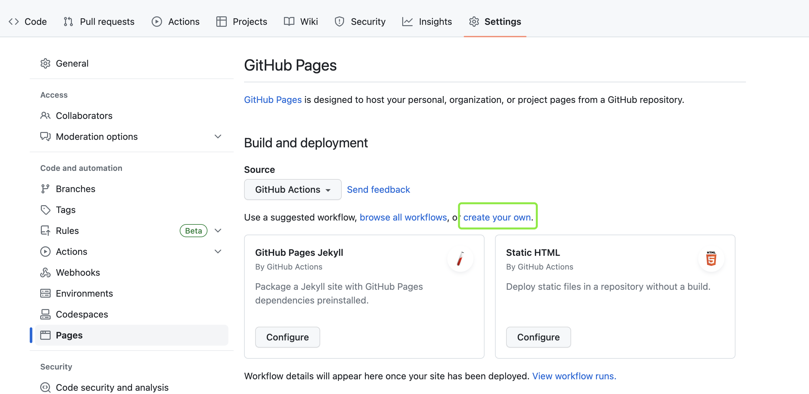

# Vitepress + GitHub Actions 自动部署博客
如何在github上部署个人博客，可以在github pages里设置项目页面路径，但是能否在代码提交后自动部署更新博客呢？试着用下面的介绍实现免费的一个个人博客吧！
## 实现步骤
- 1、在github上新建项目，克隆项目到本地
- 2、使用[vitepress](https://vitepress.dev/guide/what-is-vitepress)搭建个人博客或者技术文档项目
- 3、提交代码到github
- 4、github pages设置

- 5、在创建项目workflow文件deploy.yml，文件名自定义，提交后pages会自动发布
编写内容如下：
```js
name: CI
 
on:
    push:
        branches:
            - master
permissions:
  contents: read
  pages: write
  id-token: write
jobs:
    build-and-deploy:
        runs-on: ubuntu-latest
        steps:
            - uses: actions/checkout@v3
            - name: Use Node.js
              uses: actions/setup-node@v3
              with:
                  node-version: "14.x"
            - run: node -v
            - run: npm install
            - run: npm run build
            
            - uses: actions/configure-pages@v2
            - uses: actions/upload-pages-artifact@v1
              with:
                path: docs/.vitepress/dist
            - name: Deploy
              id: deployment
              uses: actions/deploy-pages@v1
```

## Deploy过程中遇到的问题
-  1、使用[vitepress Github Pages文档](https://vitepress.dev/guide/deploy#github-pages)中的deploy.yml遇到以下报错
```js
Run npm install && npm run build
npm ERR! code ENOTFOUND
npm ERR! syscall getaddrinfo
npm ERR! errno ENOTFOUND
npm ERR! network request to http://registry.npm.release.ctripcorp.com/vue/download/vue-3.2.47.tgz failed, reason: getaddrinfo ENOTFOUND registry.npm.release.ctripcorp.com
npm ERR! network This is a problem related to network connectivity.
npm ERR! network In most cases you are behind a proxy or have bad network settings.
npm ERR! network 
npm ERR! network If you are behind a proxy, please make sure that the
npm ERR! network 'proxy' config is set properly.  See: 'npm help config'

npm ERR! A complete log of this run can be found in:
npm ERR!     /home/runner/.npm/_logs/2023-04-20T07_15_59_282Z-debug-0.log
Error: Process completed with exit code 1.
```

-  2、[解决参考](https://stackoverflow.com/questions/72504998/github-actions-unable-to-get-actions-id-token-request-url-env-variable)
```js
Run actions/deploy-pages@v1
Error: Error message: Unable to get ACTIONS_ID_TOKEN_REQUEST_URL env variable
    at Function.<anonymous> (/home/runner/work/_actions/actions/deploy-pages/v1/webpack:/deploy-pages/node_modules/@actions/core/lib/oidc-utils.js:71:1)
    at Generator.next (<anonymous>)
    at /home/runner/work/_actions/actions/deploy-pages/v1/webpack:/deploy-pages/node_modules/@actions/core/lib/oidc-utils.js:8:1
    at new Promise (<anonymous>)
    at __webpack_modules__.8041.__awaiter (/home/runner/work/_actions/actions/deploy-pages/v1/webpack:/deploy-pages/node_modules/@actions/core/lib/oidc-utils.js:4:1)
    at Function.getIDToken (/home/runner/work/_actions/actions/deploy-pages/v1/webpack:/deploy-pages/node_modules/@actions/core/lib/oidc-utils.js:57:1)
    at Object.<anonymous> (/home/runner/work/_actions/actions/deploy-pages/v1/webpack:/deploy-pages/node_modules/@actions/core/lib/core.js:315:1)
    at Generator.next (<anonymous>)
    at /home/runner/work/_actions/actions/deploy-pages/v1/webpack:/deploy-pages/node_modules/@actions/core/lib/core.js:27:1
    at new Promise (<anonymous>)
Error: Ensure GITHUB_TOKEN has permission "id-token: write".
```
- 3、[参考vuepress-theme-reco提供的文档](https://vuepress-theme-reco.recoluan.com/views/other/github-actions.html)遇到如下报错：
```js
Run JamesIves/github-pages-deploy-action@releases/v3

    GitHub Pages Deploy Action 🚀

    🚀 Getting Started Guide: https://github.com/marketplace/actions/deploy-to-github-pages
    ❓ Discussions / Q&A: https://github.com/JamesIves/github-pages-deploy-action/discussions
    🔧 Report a Bug: https://github.com/JamesIves/github-pages-deploy-action/issues

    📣 Maintained by James Ives: https://jamesiv.es
    💖 Support: https://github.com/sponsors/JamesIves
Checking configuration and starting deployment… 🚦
Error: The directory you're trying to deploy named /home/runner/work/front-note/front-note/docs/.vuepress/dist doesn't exist. Please double check the path and any prerequisite build scripts and try again. ❗
Deployment failed! ❌
```
> 参考
- [阮一峰GitHub Actions 入门教程](https://www.ruanyifeng.com/blog/2019/09/getting-started-with-github-actions.html)